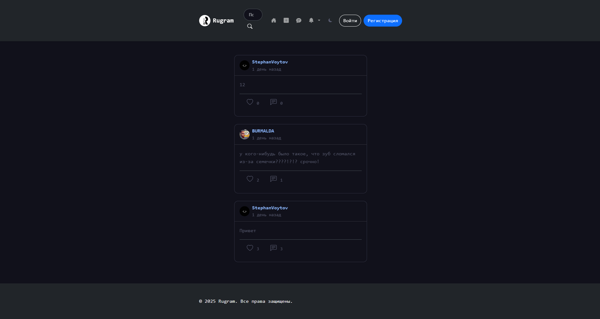

# Rugram — терминал-нативная социальная сеть
[](https://flask.palletsprojects.com/) [](https://github.com/stephanvoytov/rugram/stargazers) [](https://rugram.mooo.com)

> **Социальная сеть, которой управляют через терминал.**  
> **👉 [rugram.mooo.com](https://rugram.mooo.com) — живой демо-инстанс**

<p align="center">
  
</p>  
> Поставить лайк → `like 42`. Написать в чат → `say привет!`.  
> Найти пост → `grep "python"`. Посмотреть профиль → `neofetch @user`.  
> Обычный GUI тоже есть — для тех, кто не дружит с клавиатурой.

---

## Чем это отличается от всего остального

Большинство соцсетей — это бесконечные ленты, кнопки и попапы.  
Rugram спроектирован **для разработчиков**: здесь всё дублируется терминалом.

```bash
# Войти
login alice secret123

# Поставить лайк
like 42

# Посмотреть профиль
neofetch @alice

# Написать в личку
cd chat @bob
say привет!

# Поискать посты про Flask
grep "flask"

# Отредактировать свой профиль
nano description.txt

# Посмотреть кто онлайн
ping @alice
```

**На одной странице уживаются:** Bootstrap-карточки и `bash: command not found`,  
лайки с pop-анимацией и `man ls`, infinite scroll и `watch -n 5 feed`,  
push-уведомления и `uptime`.

---

## Ключевые возможности

### 🖥️ TTY-терминал (сигнатура проекта)
| Фича | Зачем |
|------|-------|
| Полноценный эмулятор терминала в браузере | `help` — все команды, `man` — документация |
| Unix-команды для соцсети | `cd`, `ls`, `grep`, `head`, `tail`, `cat`, `echo`, `date`, `history`, `uptime`, `export`, `watch`, `top` |
| `nano`-редактор | Редактирование постов и профиля прямо из терминала |
| `neofetch` | Профиль юзера с ASCII-артом из аватарки |
| `ping @user` | Проверка существования пользователя |
| `fortune` | Цитаты программистов |
| `export LANG=ru_RU` | Переключение языка на лету |
| Boot-анимация | Matrix Rain с вероятностью 30% |
| Маппинг на реальные URL | `cd` переходит на страницы как в файловой системе |

### 🌐 Билингвальный UI (EN + RU)
- **Английский (по умолчанию) + Русский** — `?lang=ru` в любом URL
- **Всё переключается**: интерфейс, терминал (`help`, `man`), флеш-сообщения, формы, пустые состояния
- TTY автоматически подхватывает язык из GUI

### 💬 Мессенджер с шифрованием
- Личные сообщения с polling в реальном времени
- Онлайн-статус и индикатор «печатает...»
- Дата-разделители («Сегодня», «Вчера», «15 мая»)
- Read receipts (отметки прочитано)
- **Все сообщения зашифрованы в БД** (Fernet, ключ от `SECRET_KEY`)

### 🔔 Push-уведомления
- Приходят когда сайт закрыт (Service Worker + Push API / VAPID)
- Push на новые сообщения, лайки, комментарии, подписки
- Авто-удаление просроченных подписок

### 📱 Всё остальное
- Бесконечная лента с фильтром «Все / Подписки»
- Лайки с pop + ripple анимацией (JS Web Animations API)
- Комментарии с inline-формой и auto-expand textarea
- Закладки (сохранённые посты) с сеткой
- Репосты
- Тёмная тема (учитывает системные настройки)
- Lightbox для изображений
- REST API (`/api/v1/posts`)
- Адаптивный дизайн (mobile-first)
- Docker Compose / reverse proxy (Caddy/Nginx) в production

## Технологии

**Backend:** Python 3.12, Flask, SQLAlchemy, Flask-Login, Flask-WTF, WTForms, SQLite  
**Security:** cryptography (Fernet), pywebpush (VAPID)  
**Frontend:** Jinja2, Bootstrap 5.3, Bootstrap Icons, Vanilla JS, CSS Custom Properties  
**Infra:** Docker, Alembic, Gunicorn

## Оптимизация

- **Изображения** — ресайз 1200px / превью 400px, JPEG q85, lazy loading  
- **Кеширование** — версионирование CSS/JS (`?v=timestamp`), `defer`  
- **Архитектура** — роуты разбиты на пакет (`app/routes/`), JS на модули, CSS на CSS-переменные

## Быстрый старт (Docker)

```bash
# 1. Клонировать
git clone https://github.com/stephanvoytov/rugram.git
cd rugram

# 2. Сгенерировать секретный ключ
python -c "import secrets; print(f'SECRET_KEY={secrets.token_hex(32)}')" > .env

# 3. Запустить
docker compose up -d --build
```

После сборки: **http://localhost:8000** → жми `[>_ TTY]` и пробуй команды.

> В production поставьте reverse proxy (Caddy/Nginx) на порт `8000`.

### Переменные окружения (.env)

| Переменная | Обязательно | По умолчанию | Описание |
|------------|-------------|-------------|----------|
| `SECRET_KEY` | ✅ | — | Ключ для подписи сессий и шифрования сообщений |
| `VAPID_PUBLIC_KEY` | ❌ | Встроенный | Публичный ключ для Web Push (можно сгенерировать) |
| `VAPID_PRIVATE_KEY` | ❌ | Встроенный | Приватный ключ для Web Push (можно сгенерировать) |

### Volumes

| Путь в контейнере | Назначение |
|-------------------|------------|
| `/app/instance` | SQLite база данных |
| `/app/app/static/uploads` | Загруженные изображения (аватарки, посты) |

### Миграции БД (Alembic)

При изменении моделей БД:

```bash
# Создать новую миграцию
alembic revision --autogenerate -m "описание изменений"

# Накатить
alembic upgrade head

# Откатить на одну
alembic downgrade -1
```

Миграции накатываются автоматически при старте контейнера (через `start.sh`).

### Обновление

```bash
git pull
docker compose up -d --build
```

### Логи

```bash
docker compose logs -f
```

## Структура проекта

```
app/
├── __init__.py         # create_app() фабрика
├── models.py           # SQLAlchemy модели
├── routes/             # Маршруты (пакет вместо одного routes.py)
│   ├── __init__.py     # re-export трёх blueprint'ов
│   ├── auth.py         # /auth/*
│   ├── posts.py        # /posts/*
│   ├── main.py         # /, /settings, /chat, /tty/help …
│   └── helpers.py      # _require_chat_participant(), _create_notification_and_push()
├── forms.py            # WTForms
├── crypto.py           # Fernet-шифрование сообщений
├── translations.py     # Билингвальный движок (EN/RU)
├── resources/          # REST API (/api/v1/posts)
├── static/
│   ├── css/style.css
│   └── js/
│       ├── main.js     # GUI-логика, делегат лайков/сохранений
│       └── terminal.js # TTY-терминал (полноценный эмулятор)
├── templates/
│   ├── base.html
│   ├── macros/         # Jinja2-макросы
│   ├── auth/           # login, register
│   ├── main/           # index, profile, settings, chat, tty_help …
│   └── posts/          # create_post, post
└── uploads/            # Аватарки и изображения постов
```

## Локальная разработка

```bash
git clone https://github.com/stephanvoytov/rugram.git
cd rugram
python -m venv venv

# Windows:
venv\Scripts\activate
# Linux/Mac:
source venv/bin/activate

pip install -r requirements.txt
python -c "import secrets; print(f'SECRET_KEY={secrets.token_hex(32)}')" > .env
alembic upgrade head
python run.py
```

Откройте `http://localhost:5000`

## Push-уведомления

Для работы push-уведомлений требуется HTTPS (на production — через Caddy/Let's Encrypt).

При первом клике по странице браузер запросит разрешение на уведомления. После подтверждения:
1. Регистрируется Service Worker (`sw.js`)
2. Создаётся подписка на Push API
3. Ключи подписки сохраняются на сервере

Push приходит при:
- Новом сообщении в чате (отображается имя отправителя и текст)
- Лайке, комментарии или подписке

Если браузер закрыт — push не придёт (техническое ограничение Web Push API).
Если браузер открыт, но вкладка с Rugram не активна — уведомление отобразится системой.
